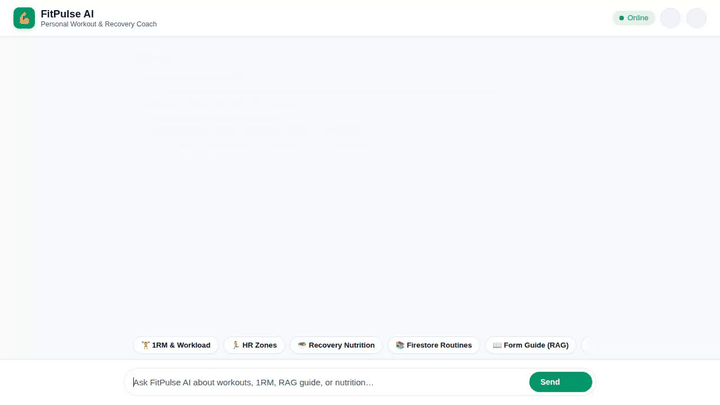

# FitPulse AI - Personal Workout & Recovery Assistant



## 📌 Overview
**FitPulse AI** is an agentic workout and recovery assistant built with the Google Agent Development Kit (ADK) and deployed to Agent Runtime on Vertex AI Agent Engine. It provides structured workout planning, 1-Rep Max (1RM) workload calculations, post-workout nutrition tracking, Firestore database routine searches, RAG-grounded exercise form guides, Imagen image generation, and rich A2UI card rendering.

---

## 🛠️ Implemented Capabilities & Wired Tools

The agent strictly implements the following tools and Google Cloud services:

### 1. 🧠 Long-Term Memory (Vertex AI Memory Bank)
- **`PreloadMemoryTool` & `generate_memories_callback`**: Persists durable user facts, preferences, muscle groups trained, personal records, and injuries across sessions using Vertex AI Memory Bank (`add_session_to_memory`).

### 2. 🗄️ Firestore Database Integration
- **`search_workout_routines_from_firestore`**: Queries curated workout routines stored in Google Cloud Firestore by muscle group, exercise type, and low-impact criteria.
- **`save_workout_routine_to_firestore`**: Saves custom workout routines directly to the Firestore database.

### 3. 📖 Exercise Guide Retrieval (Vertex AI Search / RAG Engine)
- **`consult_exercise_guide`**: Grounds exercise mechanics, targeted muscle activation, joint impact, and safety cues using the `fitpulse-exercise-benefits` Discovery Engine datastore (RAG Engine).

### 4. 🎨 Fitness Image Generation & Cloud Storage
- **`generate_fitness_image`**: Generates high-quality exercise form diagrams and meal illustrations using `gemini-3.1-flash-lite-image` in the `global` region.
- **Google Cloud Storage (GCS)**: Uploads generated image bytes to a public GCS bucket (`fitpulse-ai-media-39fe799c`) and returns public HTTPS URLs. Also saves artifacts to `ToolContext` for Playground display.

### 5. 💻 Python Sandbox Execution
- **`AgentEngineSandboxCodeExecutor`**: Executes Python code safely in an Agent Engine sandbox to calculate complex training metrics, power-to-weight ratios, and volume trends.

### 6. 🎨 Agent-Driven Rich UI (A2UI)
- **`A2uiSchemaManager` (v0.8)** & **`a2ui_callback`**: Renders responses as structured A2UI cards (Card, Column, Row, Text, Image, Icon) for interactive display in supported UIs.

### 7. 🏋️ Fitness & Nutrition Tools
- **`calculate_1rm_and_volume`**: Estimates 1-Rep Max using the Epley formula and calculates total workload tonnage with percentage load targets (90%, 80%, 70%).
- **`calculate_training_zones`**: Calculates Karvonen Target Heart Rate training zones (Zones 1–5).
- **`log_workout` & `get_workout_plan`**: Logs completed workout sessions and generates multi-day training plans.
- **`fetch_fitness_nutrition_info`**: Fetches post-workout nutritional macros (calories, protein, carbs, fat) from public REST APIs.

---

## 🏗️ Project Architecture & Directory Layout

```
fitpulse-ai/
├── app/
│   ├── agent.py               # ADK root agent configuration, tools, memory, and callbacks
│   └── a2ui_utils.py          # A2UI payload extraction and formatting helper
├── frontend/
│   ├── main.py                # FastAPI proxy server (ADC auth, session handling, streaming)
│   ├── requirements.txt       # Frontend Python dependencies
│   └── static/
│       └── index.html         # Responsive Chat UI with A2UI renderer & dark mode toggle
├── record_demo.py             # Playwright browser script for recording automated demo video
├── demo.gif                   # Inline looping demo animation
├── fitpulse_ai_demo.webm      # High-definition recorded video demo
├── agents-cli-manifest.yaml   # Manifest defining agent, region (us-east1), and runtime config
├── deployment_metadata.json   # Deployment metadata containing Agent Engine resource ID
└── pyproject.toml             # Python dependencies and project settings
```

---

## 🚀 Setup & Execution Instructions

### Prerequisites
- Python 3.10+
- `uv` package manager
- `google-agents-cli` (`uv tool install google-agents-cli`)
- Authenticated GCP credentials (`gcloud auth login` and `gcloud auth application-default login`)

### 1. Local Agent Playground
Run the agent interactively in the ADK local playground:
```bash
agents-cli playground
```

### 2. Local Frontend Proxy & Web Interface
To run the custom FastAPI proxy and chat UI locally:

```bash
# 1. Navigate to the frontend directory
cd frontend

# 2. Install frontend dependencies
uv add fastapi "uvicorn[standard]" a2a-sdk~=0.3.22 httpx google-auth

# 3. Export required environment variables (replace resource name with your Reasoning Engine ID)
export AGENT_ENGINE_RESOURCE_NAME="projects/<project-number>/locations/us-east1/reasoningEngines/<engine-id>"
export AGENT_DIRECTORY="app"
export PORT=8080

# 4. Start the FastAPI server
uv run python main.py
```
Open a browser and navigate to port 8080 on your local host.

---

## ☁️ Deployment Instructions

### Deploy Agent to Agent Runtime
```bash
agents-cli deploy
```

### Deploy Frontend Proxy to Cloud Run
```bash
gcloud run deploy fitpulse-ai-frontend \
  --source ./frontend \
  --region us-east1 \
  --allow-unauthenticated \
  --set-env-vars AGENT_ENGINE_RESOURCE_NAME="<your-reasoning-engine-resource-name>",AGENT_DIRECTORY="app"
```
